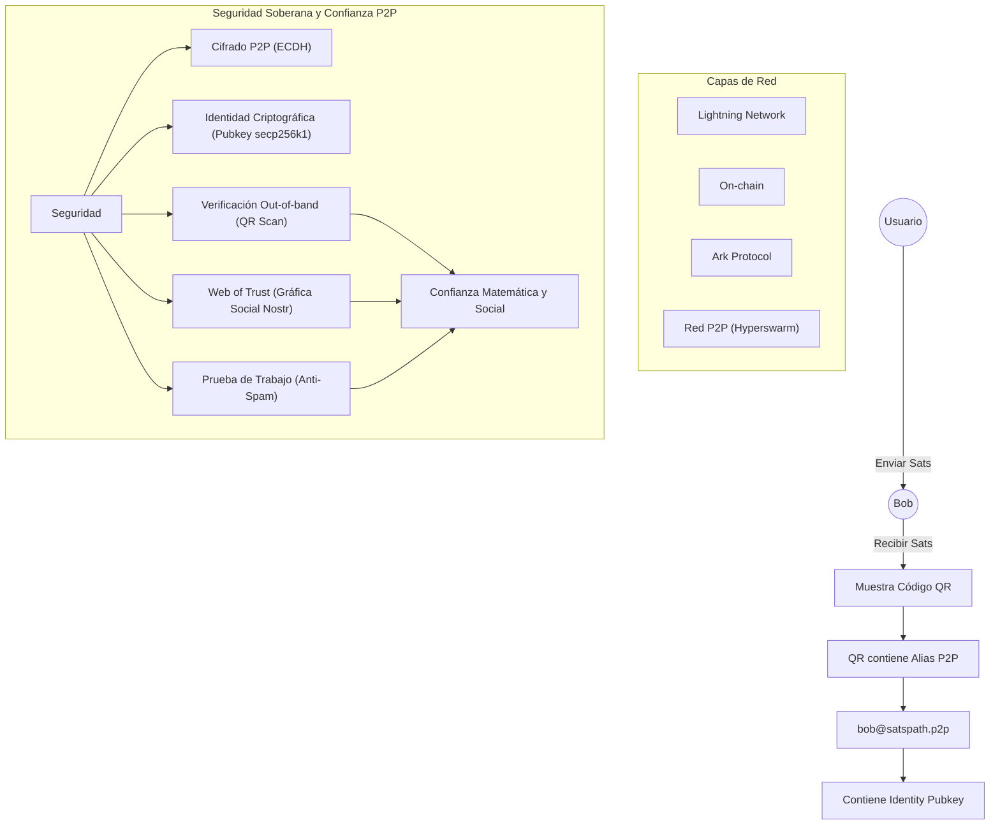
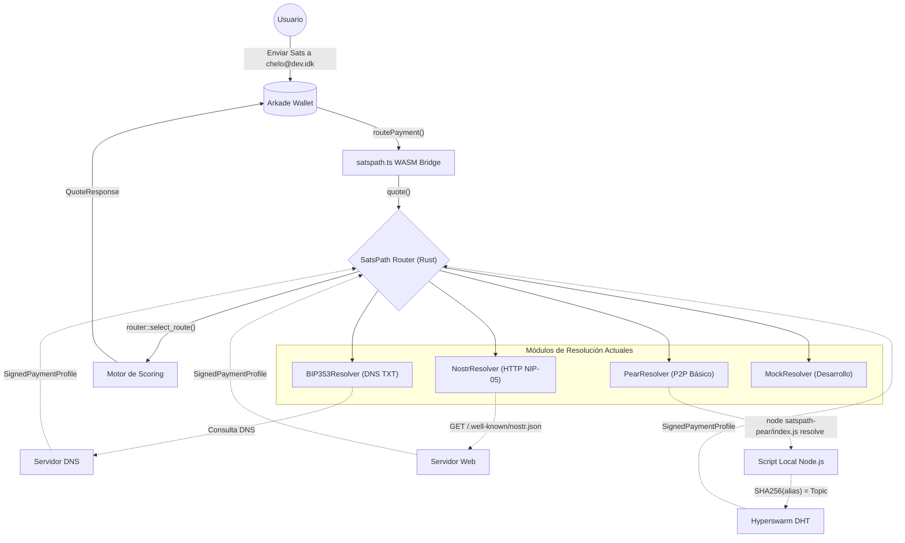

# Arquitectura de SatsPath en Arkade Wallet

El protocolo de **SatsPath** está completamente integrado en la wallet a través de un puente con WebAssembly (WASM). Esto permite que toda la criptografía pesada y la lógica de ruteo y resolución ocurran de forma ultra-rápida y segura del lado del cliente, utilizando el mismo código robusto en Rust de `satspath-core`.

A continuación te presento un diagrama de secuencia de cómo fluyen los datos en las dos etapas principales: el **Flujo del Receptor** (creación de identidad) y el **Flujo del Emisor** (resolución y envío).

## Componentes Clave

1. **Arkade Wallet (React):** Es la capa de presentación. Maneja las animaciones (como los láseres), la recolección de datos del usuario, el guardado local y muestra los resultados finales.
2. **`satspath.ts` (WASM Bridge):** Es el traductor. Se encarga de convertir los objetos de JavaScript a los tipos primitivos que espera Rust, y viceversa. Aquí es donde inyectamos los "mocks" para desarrollo.
3. **`satspath-wasm` (Rust):** El cerebro de la operación. Hereda el código de `satspath-core`. Contiene el generador criptográfico seguro, la lógica matemática de las firmas de Schnorr, y el motor de Scoring que decide si es más barato irse por Ark, Lightning o On-chain dependiendo de las comisiones en tiempo real.

## Visión: Arquitectura Soberana P2P

Este es el modelo teórico 100% cypherpunk que busca eliminar la dependencia de servidores DNS y HTTP, garantizando privacidad mediante conexiones enjambre y Web of Trust.

---

## Arquitectura Actual (Implementada en el Código)

A diferencia del diagrama teórico 100% soberano que discutimos arriba, el código actual de `satspath-core` y `satspath-router` implementa una arquitectura híbrida de transición. 

Actualmente, el sistema resuelve los alias apoyándose en infraestructuras existentes (DNS y HTTP) y tiene un prototipo básico de P2P con Pear/Hyperswarm, pero **aún no implementa** el cifrado ECDH, los Handshakes ni las pruebas anti-spam (Hashcash).

Aquí tienes el diagrama exacto de cómo funciona el código **hoy**:

---

## Implementation Plan: Migración a P2P Soberano (Trusted Connections)

Para lograr que el código de SatsPath cumpla con el modelo 100% soberano (y resolver el problema de privacidad del alias expuesto), se debe ejecutar el siguiente plan de desarrollo:

### Fase 1: Enjambres Ofuscados y Cifrado (ECDH)
1. [ ] **Derivación de Tópico Seguro:** Modificar `satspath-core` para que no pase el alias en texto plano al script de Node.
2. [ ] **ECDH Compartido:** Implementar Diffie-Hellman usando la `IdentityPubkey` del emisor y receptor para generar un secreto. El `Topic` de Hyperswarm será el `SHA256(SharedSecret)`.
3. [ ] **Cifrado de Carga Útil:** Usar ChaCha20-Poly1305 (con el secreto compartido) para encriptar los paquetes de datos P2P, garantizando confidencialidad total.

### Fase 2: Protocolo TCP-Style (SYN / SYN-ACK)
1. [ ] **Paquete SYN (Emisor -> Receptor):** El nodo de Hyperswarm emisor debe enviar un payload cifrado con su intención de pago (`Amount` y `Nonce` aleatorio), y firmado criptográficamente por la Wallet.
2. [ ] **Generación Just-In-Time (Ark):** El nodo receptor recibe el SYN, valida la firma, y detona un llamado al servidor ASP de Ark para generar un VTXO dinámico que se bloquee específicamente para esta transacción.
3. [ ] **Paquete SYN-ACK (Receptor -> Emisor):** El receptor devuelve el invoice fresco, su alias local, y firma el `Nonce` para probar liveness.

### Fase 3: Escudos Anti-Bot / Anti-IA (Web of Trust)
1. [ ] **Módulo de Web of Trust (WoT):** Integrar Nostr (NIP-65) en la wallet para mantener una gráfica social de llaves públicas conocidas.
2. [ ] **Reglas de Aceptación:** Configurar el demonio P2P para rechazar/dropear automáticamente conexiones `SYN` de Pubkeys que estén a más de 2 grados de separación en la red de confianza.
3. [ ] **Integración de Hashcash (Lightning/Ark):** Obligar a conexiones fuera de la WoT a adjuntar un HTLC válido por una micro-transacción de 10 sats para cubrir el costo computacional del ataque Sybil.
